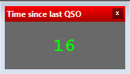

# Custom Forms for DXLog.net

## Time Since Last QSO

As a little incentive to work stations faster, keeping an eye on the seconds since the last QSO can make a real difference.
The information is technically available in DXLog.net, but it tends to get lost between the other statistics in the Rate window.

That's why this project includes a dedicated window under `CustomForms/` — it starts counting the moment a QSO is logged, displays the elapsed seconds in large text, and gradually shifts color as time goes on. 

### Color scheme

| Time | Color |
|------|-------|
| 0 – 30 s | Green |
| 30 – 60 s | Transition green → yellow |
| 60 – 90 s | Yellow |
| 90 – 180 s | Transition yellow → red |
| > 180 s | Red (displays `>180`) |

All four colors (Background, Color, Warning, Alert) can be customized via right-click on the window.

### Installation

1. Copy the DLL to `%appdata%\DXLog.net\CustomForms`.
2. Restart DXLog.net.
3. Open the window via **Custom** menu.

Font size and colors can be adjusted at any time via right-click on the window.

